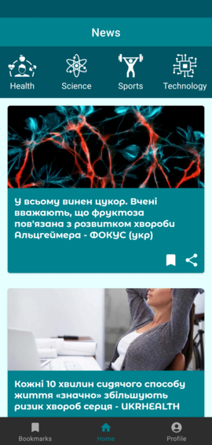
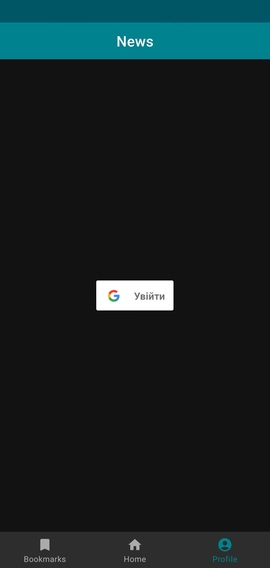
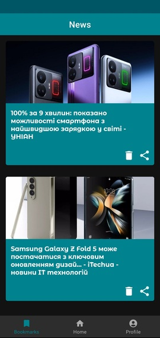

# **News**
News is an Android application that allows users to browse news articles, register and login to their accounts, and bookmark articles for future reference.

## **Download**
[APK](https://drive.google.com/file/d/1i0zmgvVfFWrLZ-V8sjS11JEBSD5TncjX/view?usp=share_link)

## **Features**
+ Browse and read news articles.
+ Create an account and log in.
+ Save news articles to bookmarks for easy access.
+ Delete news articles from bookmarks.
+ Share news articles with your friends.
+ Filter news articles by category.

## **Technologies**
+ Kotlin 
+ Clean Architecture
+ MVVM
+ Koin
+ Firebase Authentication
+ Firebase Realtime Database
+ Glide
+ Coroutine
+ Retrofit
+ Room
+ Navigation component
+ [News API](https://newsapi.org)

## **Usage**
1. On the home screen, browse the list of articles.
2. Click on an article to read it.
3. To register or log in, go to "Profile" screen and click the "Log in" button. 
4. To save an article to bookmarks, you must log in and click the bookmark icon.
5. To delete an article from bookmarks, click to the trash icon.
6. To view your bookmarks, go to the "Bookmarks" screen.
7. To filter articles by category, use the corresponding buttons on the home screen.

## **Screenshots**
   
